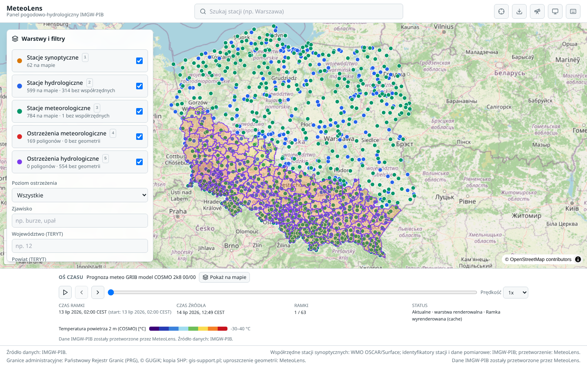
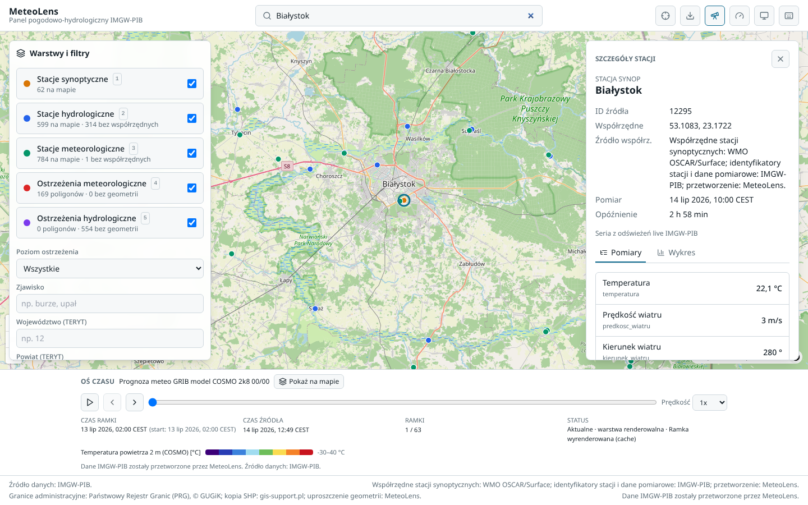
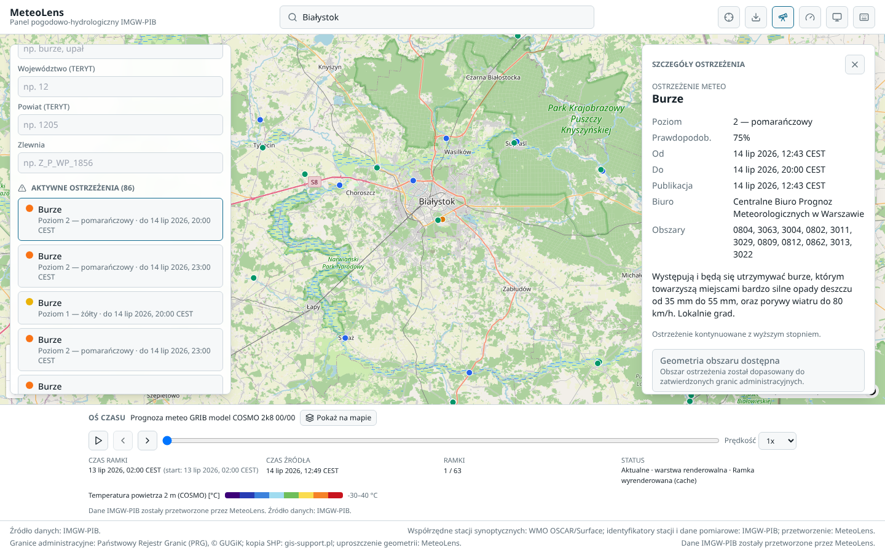
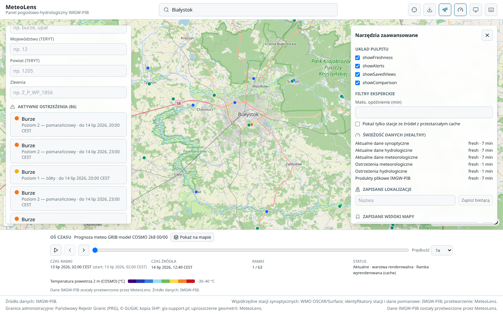

# MeteoLens

**Status: public alpha (`v0.1.0-alpha` candidate; not tagged yet).** MeteoLens
works end to end against live IMGW-PIB data, but it is an alpha: expect the
gaps listed in [Known Limitations](#known-limitations) (hydro warning basins
still lack reviewed polygons, radar downloads are blocked at the source,
history starts empty unless backfilled). The current-main validation record is
[docs/release/STAGE_21_VALIDATION_2026-07-14.md](docs/release/STAGE_21_VALIDATION_2026-07-14.md).
It found an unresolved SYNOP live/archive station-ID reconciliation blocker, so
tagging and GitHub prerelease publication remain pending.

MeteoLens is a web application for visualising public IMGW-PIB weather and
hydrological data for Poland. Stages 0-18 (research, documentation, backend
API, IMGW integration, the frontend map UI, quality/test hardening, production
deployment, observation history, geometry datasets, product timeline,
PWA/power-user features, public-alpha release polish, the reviewed geometry
dataset MVP with bundled PRG voivodeship/county polygons, and the product
rendering MVP with the COSMO 2 m temperature map overlay, bounded SYNOP daily
archive backfill, the public API/SDK/export stabilization pass, documentation
status stabilization, reviewed WMO OSCAR/Surface synop station coordinates,
and Stage 19 public-internet security hardening, plus Stage 20 production
observability, backup, and recovery) are implemented. Stage 21 current-main
validation is recorded for the alpha candidate and has an unresolved SYNOP
identifier-reconciliation blocker; tagging and prerelease publication are
pending. Stages 22-26 remain planned and cover hydrology, warning history,
performance, and PDF reports. See [TASKS.md](TASKS.md) for the full staged
backlog.

The working package name is `meteolens`. Possible future product names:
PogodoScope, HydroMeteo Atlas, MeteoMapa PL.

## What It Does

- Show Poland as the main interactive map view.
- Display layers for synoptic stations, hydrological stations, meteorological
  stations, meteorological warnings, and hydrological warnings.
- Show measurement timestamp, retrieval timestamp, data delay, source, missing
  values, and processed-data notices.
- Provide simple and expert modes.
- Support search, "My location", station details, warning details, charts,
  exports, keyboard shortcuts, permalinked map state, and light/dark/system
  themes.

## Current Status

Implemented now:

- IMGW-PIB source research.
- Architecture decision record in documentation.
- Public backend API contract.
- UI/UX specification.
- Legal attribution rules.
- Implementation backlog and staged task list.
- FastAPI backend with `/health`, `/api/v1/sources`, map layers, stations,
  warnings, location summary, and CSV/JSON/GeoJSON exports backed by the cache.
- React/Vite map-first frontend: layer toggles, station markers, station and
  warning details (with mobile bottom sheet), station search, "My location",
  ECharts station chart, CSV/JSON/GeoJSON/PNG exports, URL permalinks, keyboard
  shortcuts, light/dark/system theme, simple/expert mode, and explicit
  loading/empty/stale/partial/error states. Station metric lists use Polish
  labels and show the latest snapshot, while historical points remain in the
  chart.
- Docker Compose, `.env.example`, CI (backend, frontend, and E2E jobs), lint,
  and tests.
- IMGW-PIB HTTP client, parser layer, normalized models, file cache, and parser
  tests for current synop/hydro/meteo/warning endpoints plus product manifests.
- Live IMGW startup cache refresh (`METEOLENS_SYNC_ON_STARTUP`) and a periodic
  in-process refresh scheduler (`METEOLENS_REFRESH_ENABLED` with
  `METEOLENS_REFRESH_*_SECONDS` intervals), both enabled by default in Docker
  Compose, with their own refresh tests.
- Stage 6 quality work: expanded backend/frontend test coverage, a Playwright
  E2E suite, and verified attribution/missing-value handling (see
  [Known Limitations](#known-limitations)).
- Stage 7 production deployment: nginx + runtime images, production Compose
  file, and hardening checklist — see [DEPLOYMENT.md](DEPLOYMENT.md).
- Stage 8 observation history: SQLite history persisted on each successful
  IMGW refresh with configurable retention
  (`METEOLENS_OBSERVATION_RETENTION_DAYS`), a time-series API with metric,
  time-range, `interval`, and `limit` parameters plus `series_kind`
  snapshot-fallback metadata, station comparison and rankings endpoints,
  time-range exports, and a station chart that renders real multi-point line
  series when history exists.
- Stage 9 geometry and spatial warnings: a manifest-driven local geometry
  cache (`data/geometry/`, `METEOLENS_GEOMETRY_DIR`,
  `/api/v1/geometry/datasets`), TERYT/basin code-to-polygon mapping for
  warning map layers and warning details, polygon-based "My location" warning
  matching, and province/county/basin warning filters with explicit
  unresolved-geometry metadata (see `docs/geometry/GEOMETRY_SOURCES.md`).
- Stage 10 product timeline: IMGW product ID research
  (`docs/products/PRODUCT_RESEARCH.md`), product catalog and frame metadata
  APIs (`/api/v1/products`, `/api/v1/products/{id}/frames`,
  `/api/v1/map/timeline`), and a frontend timeline bar with play/step
  controls and explicit metadata-only / not-renderable labels.
- Stage 11 PWA and power-user features: cache freshness and
  warning-vs-station comparison endpoints, an expert-mode power-user panel
  (saved locations, saved map views, dashboard widgets, local alert rules,
  freshness monitor, advanced filters — all browser-local storage), and a
  minimal installable PWA shell.

- Stage 12 public alpha release polish: recorded local and production smoke
  tests against live IMGW data
  ([docs/release/SMOKE_TEST_2026-07-03.md](docs/release/SMOKE_TEST_2026-07-03.md)),
  a repeatable browser smoke script (`frontend/scripts/smoke.mjs`),
  populated-cache screenshots under `docs/screenshots/`, this alpha status
  section, and a
  [v0.1.0-alpha release checklist](docs/release/RELEASE_CHECKLIST_v0.1.0-alpha.md).

- Stage 13 reviewed geometry dataset MVP: a reviewed-manifest format with
  full source/legal metadata, a validating geometry import CLI
  (`python -m app.geometry.import_cli`), bundled PRG © GUGiK voivodeship and
  county polygons (so meteo warning polygons and province/county filters work
  out of the box), a reproducible conversion script
  (`scripts/geometry/convert_prg_shapefiles.py`), and reviewed-source geometry
  enrichment hooks. Stage 18 now bundles reviewed WMO OSCAR/Surface synop
  station coordinates, so synop markers can render with `coordinate_source`
  metadata — see
  `docs/geometry/GEOMETRY_SOURCES.md`.

- Stage 14 product rendering MVP: the first real rendered product layer —
  COSMO 2 m temperature decoded from public IMGW GRIB1 files server-side,
  reprojected from the model's rotated grid, and drawn on the map as a
  semi-transparent overlay with frame/run times, a legend, attribution, and a
  processed-data notice (`/api/v1/products/{id}/render/{filename}`). Rendering is
  an explicit opt-in ("Pokaż na mapie" in the timeline bar) because each new
  frame downloads a ~160 MB source file on the backend; rendered PNGs are
  cached with retention limits. Radar composites stay metadata-only — IMGW
  currently blocks public downloads of those files (documented in
  `docs/products/PRODUCT_RESEARCH.md`).

- Stage 15 historical archive backfill: an opt-in server-side importer for
  bounded daily SYNOP archive ranges
  (`POST /api/v1/archive/backfill/synop-daily?from=YYYY-MM-DD&to=YYYY-MM-DD`).
  Imported observations are written into the existing SQLite observation
  history with `origin: "archive_import"`, import-run metadata, IMGW-PIB
  attribution, processed-data notices, missing/null preservation, duplicate
  upserts, and retention interaction. The station observations API labels
  `live_refresh`, `archive_import`, and `mixed` series. Real current SYNOP
  `id_stacji` ↔ archive `NSP` reconciliation is not implemented yet, so the
  imported archive series remains explicit and separate until a reviewed
  mapping source is available.

- Stage 16 public API, SDK, and power-user exports: the `/api/v1` contract now
  documents versioning, compatibility, and responsible-use guidance; station
  observation range CSV/JSON exports, warning GeoJSON exports, and map-state
  JSON exports are available; the frontend export menu links them where
  relevant; `packages/meteolens-api-client/` contains a lightweight TypeScript
  client with OpenAPI-generated metadata; and runnable integration examples
  live in `examples/api/`.

- Stage 20 production operations: separate liveness/readiness health checks,
  private Prometheus metrics, request-correlated JSON logs, conservative Docker
  CPU/memory/log limits, and verified essential backup/restore tooling for
  SQLite, cache metadata, and geometry. See [DEPLOYMENT.md](DEPLOYMENT.md) and
  [the incident runbook](docs/operations/INCIDENT_RUNBOOK.md).

Remaining gaps: see [Known Limitations](#known-limitations) below.

## Data Sources

Primary source: IMGW-PIB public data service at
[danepubliczne.imgw.pl](https://danepubliczne.imgw.pl/).

The initial source set is documented in [DATA_SOURCES.md](DATA_SOURCES.md):

- current synoptic data,
- current hydrological data,
- current meteorological data,
- current meteorological warnings,
- current hydrological warnings,
- product/file API,
- archived warnings,
- measurement and observation archives.

## Quick Start

Run the backend locally:

```bash
cd backend
python -m venv .venv
.venv/bin/pip install ".[dev]"
.venv/bin/uvicorn app.main:app --reload
```

Run the frontend locally:

```bash
cd frontend
npm install
npm run dev
```

The frontend reads the backend base URL from `VITE_API_BASE_URL` (default
`http://localhost:8000`). If port 8000 is taken by another app, run the backend
elsewhere and point the frontend at it: copy `frontend/.env.example` to
`frontend/.env.local`, set `VITE_API_BASE_URL=http://localhost:<port>`, and
restart `npm run dev`. To populate the backend cache with live IMGW data during
manual backend startup, set `METEOLENS_SYNC_ON_STARTUP=true` before running
Uvicorn. With an empty cache the UI shows explicit empty/stale states instead of
mock data.

Run both with Docker Compose:

```bash
docker compose up --build
```

Docker Compose enables `METEOLENS_SYNC_ON_STARTUP=true`, so the backend fetches
the configured live IMGW sources and writes the normalized file cache before the
frontend is marked ready. It also enables `METEOLENS_REFRESH_ENABLED=true`, so
the backend keeps re-fetching each source on its configured
`METEOLENS_REFRESH_*_SECONDS` interval while it runs.

Optional daily SYNOP archive backfill is manual and bounded:

```bash
curl -X POST "http://localhost:8000/api/v1/archive/backfill/synop-daily?from=2026-05-01&to=2026-05-07"
```

Limits are controlled with `METEOLENS_ARCHIVE_BACKFILL_MAX_DAYS`,
`METEOLENS_ARCHIVE_BACKFILL_MAX_FILES`, and
`METEOLENS_ARCHIVE_BACKFILL_RATE_LIMIT_SECONDS`. Archive fetching always runs
server-side; the browser never calls IMGW archive files directly.

Public API examples:

```bash
node examples/api/list-stations.mjs --type hydro --limit 5
node examples/api/check-source-freshness.mjs
node examples/api/active-warnings-for-location.mjs 52.23 21.01 --radius-km 75
```

The examples use `METEOLENS_API_BASE_URL` when the backend is not at
`http://localhost:8000`. See [examples/api/README.md](examples/api/README.md)
and [docs/power-user/OPENAPI_CLIENT.md](docs/power-user/OPENAPI_CLIENT.md).

Local URLs:

- Frontend: `http://localhost:5173`
- Backend healthcheck: `http://localhost:8000/health`
- Backend source status: `http://localhost:8000/api/v1/sources`

Production smoke test (nginx + runtime backend image):

```bash
cp deploy/.env.production.example .env.production
docker compose --env-file .env.production -f docker-compose.prod.yml up --build
```

Then open `http://localhost:8080`. See [DEPLOYMENT.md](DEPLOYMENT.md) and
[deploy/PRODUCTION_CHECKLIST.md](deploy/PRODUCTION_CHECKLIST.md).

## Stack

- Frontend: React, TypeScript, Vite, Tailwind CSS, shadcn/ui, MapLibre GL,
  Apache ECharts, TanStack Query, Zustand.
- Backend: Python, FastAPI, Pydantic, httpx, scheduler, SQLite for MVP, Alembic
  with a migration path to PostgreSQL/PostGIS/TimescaleDB.
- Deployment: Docker Compose for local and small production deployments.

## Screenshots

Captured on 2026-07-14 from a populated live IMGW-PIB cache (not fixtures);
every view keeps the IMGW-PIB attribution and processed-data notice visible.
The map now shows 62 reviewed-coordinate SYNOP markers and resolved PRG meteo
warning polygons. Hydro warnings deliberately remain list-only when their
`kod_zlewni` has no reviewed basin geometry (see
[Known Limitations](#known-limitations)).

Map view with live station layers and the active warning list:



Station details in expert mode, with retrieval timestamp, data delay, explicit
missing fields, and raw source JSON:



Meteorological warning details with resolved reviewed administrative geometry:



Expert power-user panel with source freshness, saved locations/views, and
local alert rules (clearly labelled as not an official alerting system):



To re-capture against a fresh live cache, follow
[docs/screenshots/README.md](docs/screenshots/README.md) or run the smoke
script with a screenshot directory (see
[docs/release/STAGE_21_VALIDATION_2026-07-14.md](docs/release/STAGE_21_VALIDATION_2026-07-14.md)).
The target layout is specified in [UI_UX.md](UI_UX.md).

## Exports

- CSV for selected station data, including selected time ranges.
- JSON for selected station details, station observation ranges, and current
  map state.
- GeoJSON for visible map objects.
- GeoJSON for warning polygons/non-spatial warning records with unresolved
  geometry metadata.
- PNG for the current map view.
- PDF reports are not implemented; the optional plan is documented in
  [docs/power-user/PDF_EXPORT_PLAN.md](docs/power-user/PDF_EXPORT_PLAN.md).

Every export must include IMGW-PIB attribution and, when applicable, a processed
data notice.

## Attribution

MeteoLens uses data from Instytut Meteorologii i Gospodarki Wodnej - Państwowy
Instytut Badawczy (IMGW-PIB). UI, exports, and documentation must identify
IMGW-PIB as the source. If MeteoLens normalizes, aggregates, interpolates, or
otherwise transforms data, the output must also say that IMGW-PIB data has been
processed.

See [LEGAL_ATTRIBUTION.md](LEGAL_ATTRIBUTION.md).

## License

MeteoLens code and documentation are released under the
[MIT License](LICENSE). Source weather and hydrological data remains governed
by the applicable IMGW-PIB terms and any other source-specific terms.

## Known Limitations

These are known, accepted gaps ahead of an MVP release — not bugs to silently
work around. Each one is either a documented backend constraint or an
intentional scope deferral; do not paper over them with mock/interpolated
data (see `AGENTS.md`).

- **Hydro warning areas still have no polygons.** Stage 13 ships reviewed PRG
  voivodeship and county polygons, so meteo warning TERYT codes resolve to
  polygons out of the box. Hydro `kod_zlewni` basin geometry
  (`hydro_basins`) remains `planned` pending MPHP licensing review, so hydro
  warnings stay list-only with `geometry_not_found` /
  `missing_area_geometry_dataset` metadata. The bundled administrative
  polygons are a simplified 2022 PRG snapshot (processed data, not for
  legal/cadastral use). See `docs/geometry/GEOMETRY_SOURCES.md`.
- **Synoptic station coordinates come from reviewed WMO metadata.**
  `api/data/synop` does not return `lat/lon`; Stage 18 bundles a reviewed
  `synop_stations` dataset resolved from WMO OSCAR/Surface by WIGOS ID, so
  current synop stations render as map markers with visible
  `coordinate_source` metadata. Future station IDs that are not present in the
  reviewed dataset remain explicit as `missing_lat_lon`.
- **Observation history is local-only.** Time series are persisted to SQLite
  from this deployment's own IMGW refreshes, and Stage 15 can optionally
  backfill bounded daily SYNOP archive ranges. Other measurement archives
  (hydro daily/monthly/annual and non-SYNOP meteorological archive families)
  remain documented but not imported. Fresh deployments without a live cache can
  still serve imported station observations by stable station ID, but map/list
  station discovery still depends on current cache data and reviewed geometry.
  Retention is capped by `METEOLENS_OBSERVATION_RETENTION_DAYS`.
- **Real SYNOP live/archive series are not reconciled yet.** Current IMGW
  SYNOP uses `id_stacji`, while the bounded daily archive uses a different
  `NSP` identifier. Both origins are preserved and exposed separately, but a
  reviewed reconciliation map is required before a current station can show a
  real combined `mixed` series. This is the outstanding Stage 21 release
  blocker; it must not be papered over with name matching or hardcoded IDs.
- **Timeline/animation for products.** When cached product frame manifests exist,
  the bottom timeline shows frame metadata with play/step controls and explicit
  “metadata only / not renderable on map” labels. COSMO 2 m temperature frames
  additionally render as a map overlay after the explicit "Pokaż na mapie"
  opt-in; the first render of each frame downloads a ~160 MB GRIB file on the
  backend and can take tens of seconds before the cached PNG makes playback
  instant. Only leads up to `METEOLENS_PRODUCT_RENDER_MAX_LEAD_HOURS` every
  `METEOLENS_PRODUCT_RENDER_LEAD_STEP_HOURS` hours are renderable.
- **Basin filters only work with installed basin geometry.** Province and
  county filters work against the bundled PRG datasets; the basin filter
  matches only literal `kod_zlewni` values from warning metadata until a
  reviewed `hydro_basins` dataset is installed (see the hydro limitation
  above).
- **No public cache-refresh endpoint.** Docker Compose populates the cache at
  backend startup via `METEOLENS_SYNC_ON_STARTUP=true` and keeps it fresh with
  the periodic scheduler (`METEOLENS_REFRESH_ENABLED=true`); there is still no
  user-facing "refresh data" API call.
- **Radar files are not downloadable from IMGW.** Verified 2026-07-05: every
  radar composite file URL (binaries and PNG previews) 307-redirects to an
  HTML page, so radar frames stay metadata-only
  (`rendering_status: download_blocked`) until IMGW restores public file
  delivery. Only the COSMO `*_00` 2 m temperature path renders on the map;
  other GRIB variables remain undecoded (see
  `docs/products/PRODUCT_RESEARCH.md` and `docs/products/RASTER_PIPELINE.md`).
- **Some `product` IDs are listed but not retrievable.** Research on 2026-07-01
  found 32/42 manifest IDs returning 404 at the detail endpoint; see
  `docs/products/PRODUCT_RESEARCH.md` for the full classification.
- **E2E tests run against seeded fixtures, not live IMGW-PIB.** `npm run
  test:e2e` seeds the backend cache from `backend/tests/fixtures` so CI does
  not depend on the real endpoint's availability or rate limits — it verifies
  the app's own request/response handling, not IMGW-PIB's live behavior.
- **Expert mode tools.** Saved locations, saved map views, local alert rules,
  freshness monitor, and warning-vs-station comparison live in the advanced panel
  (browser-local storage). MeteoLens is not an official alerting system.
- **Minimal PWA shell.** Manifest and service worker cache static assets only; IMGW
  data still requires a live backend connection.
- **Source-terms verification stays with the deployer.** Attribution and
  processed-data notices are implemented and tested, but deployers must still
  verify current IMGW-PIB terms before public or commercial use (see
  `LEGAL_ATTRIBUTION.md` → "Commercial And Public Use" and
  [deploy/PRODUCTION_CHECKLIST.md](deploy/PRODUCTION_CHECKLIST.md)).
- **This is an untagged alpha candidate, not a public-demo approval.** Current-
  main validation, abuse protection, observability, and backup/restore checks
  are recorded, but a deployer must still review source terms and complete the
  per-host [production checklist](deploy/PRODUCTION_CHECKLIST.md). The tag and
  GitHub prerelease have not yet been created.

## Troubleshooting

For scoped gaps in the current release, see [Known Limitations](#known-limitations)
above. For runtime problems (port conflicts, CORS, source errors), see
[TROUBLESHOOTING.md](TROUBLESHOOTING.md).

## Development Checks

Backend:

```bash
cd backend
.venv/bin/ruff check .
.venv/bin/pytest
```

Frontend:

```bash
cd frontend
npm run lint
npm test
npm run build
```

End-to-end (Playwright, drives a real backend + frontend against seeded
fixture data instead of live IMGW-PIB):

```bash
cd frontend
npx playwright install chromium  # first run only
npm run test:e2e
```

Live smoke test (drives a running stack — dev or production — through the
map, station details, warnings, exports, and expert tools; optionally captures
the README screenshots):

```bash
cd frontend
node scripts/smoke.mjs http://localhost:5173 http://localhost:8000 [screenshotDir]
```
