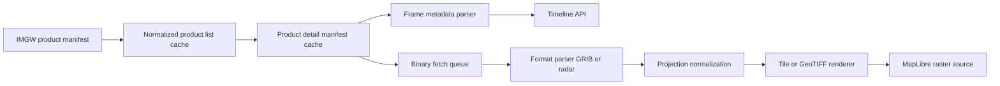

# Raster And Product Ingestion Pipeline Design

Stage 10 design only. **No binary parsing or map rendering is implemented yet.**

## Goals

1. Keep IMGW HTTP access in the backend only.
2. Separate manifest metadata from large binary downloads.
3. Make frame time, stale state, missing frames, and processed-data notice visible in
   API and UI before any radar layer is drawn on the map.
4. Cap disk usage for high-cadence radar products.

## Pipeline Stages

Implemented in Stage 10: **A → D → E** (metadata path).

Deferred: **F → J** (binary rendering path).

## Cache Layers

| Layer | Location | TTL / retention | Contents |
| --- | --- | --- | --- |
| Product list | `data/cache/product.json` | 60 min (existing source refresh) | Normalized `ProductManifest` rows |
| Product detail manifest | `data/cache/product_details/{id}.json` | `METEOLENS_PRODUCT_DETAIL_CACHE_SECONDS` (default 3600 s) | File list JSON from IMGW detail endpoint |
| Binary files | `data/products/{id}/` (planned) | `METEOLENS_PRODUCT_FILE_RETENTION_HOURS` (default 24 h) | Downloaded `.grib`, `.sri`, `.cmax`, previews |
| Render artifacts | `data/tiles/{id}/` (planned) | Same as binaries or shorter for tiles | PNG/WebP tiles or COG GeoTIFF |

Stage 10 writes **detail manifest cache only** through tests/ops seeding helpers. A
scheduled refresh job should be added before production radar use.

## Frame Metadata Rules

Filename parsers live in `backend/app/products/frames.py`:

- **COSMO GRIB manifests:** valid time from the second `YYYYMMDDHHmm` group.
- **Radar composites:** first 14 digits before reflectivity suffix (`.sri`, `.cmax`).
- **`readme.txt`:** metadata frame with no `frame_time`.
- **`*_echoOnly.png`:** preview frame; do not treat as primary radar source.

API responses expose:

- `frame_time`, `frame_kind`, `missing`, `rendering_status`
- aggregate `missing_frames`, `stale`, `retrieved_at`

## MapLibre Rendering Strategy (Deferred)

Evaluate in order:

1. **Pre-generated XYZ/PNG tiles** — simplest for radar previews if IMGW PNG echo
   files are legally and technically accessible; requires georeferencing metadata.
2. **COG GeoTIFF + MapLibre `raster` source** — better for model grids once GRIB is
   decoded and reprojected to EPSG:3857 or EPSG:4326 bounds.
3. **Dynamic server-side rendering** — fallback when tile prep is too heavy; must be
   rate-limited and cached aggressively.

Do not fetch full 4 000+ frame manifests into browser memory. Paginate with
`limit`/`offset` (already exposed) and let the timeline request windows of frames.

## Timeline UI Requirements

The Stage 10 frontend shell (`TimelineBar`) shows when `/api/v1/map/timeline`
returns product layers. Labels distinguish:

- frame time vs source/retrieval time,
- stale manifest state,
- missing frame timestamps,
- metadata-only mode when `frames_renderable=false`.

Keyboard shortcuts (when timeline focused):

- `Space` — play/pause
- `ArrowLeft` / `ArrowRight` — step frames

## Retention Policy

Defaults (`backend/app/core/config.py`):

- `METEOLENS_PRODUCT_DETAIL_CACHE_SECONDS=3600`
- `METEOLENS_PRODUCT_FILE_RETENTION_HOURS=24`
- `METEOLENS_PRODUCT_MAX_CACHED_FILES=500`

Recommended ops rules once binaries are enabled:

1. Never retain more than `PRODUCT_MAX_CACHED_FILES` per product ID.
2. Evict oldest frames first (LRU by `frame_time`).
3. Refuse download when free disk < configured safety margin.
4. Log every binary fetch with `source_key`, product ID, bytes, and status.

## Next Implementation Steps

1. Background job to refresh detail manifests for `stable_retrievable` IDs only.
2. Probe binary download headers and document final file URLs for SRI/CMAX/COSMO.
3. Spike parser on one small COSMO lead file and one radar preview PNG.
4. Choose MapLibre raster strategy based on spike results.
5. Add tile endpoint `GET /api/v1/tiles/{product_id}/{z}/{x}/{y}` after rendering
   path is chosen.
