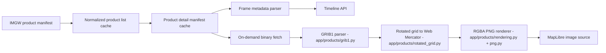

# Raster And Product Ingestion Pipeline

Stage 10 designed this pipeline; Stage 14 implemented the first rendering
path: **COSMO 2 m temperature** rendered server-side to a Web-Mercator-aligned
PNG and drawn by MapLibre as an image source. Radar composites remain
metadata-only because IMGW does not currently serve their files publicly (see
[PRODUCT_RESEARCH.md](./PRODUCT_RESEARCH.md), "Stage 14 Download Verification").

## Goals

1. Keep IMGW HTTP access in the backend only.
2. Separate manifest metadata from large binary downloads.
3. Make frame time, stale state, missing frames, and processed-data notice visible in
   API and UI before any layer is drawn on the map.
4. Cap disk usage for high-cadence and large-file products.

## Pipeline Stages

Implemented: **A → E** (metadata path, Stage 10) and **F → J** (rendering
path, Stage 14, COSMO `*_00` products / variable `t2m` only).

## Cache Layers

| Layer | Location | Limits | Contents |
| --- | --- | --- | --- |
| Product list | `data/cache/product.json` | 60 min source refresh | Normalized `ProductManifest` rows |
| Product detail manifest | `data/cache/product_details/{id}.json` | TTL `METEOLENS_PRODUCT_DETAIL_CACHE_SECONDS` (3600 s), count `METEOLENS_PRODUCT_MAX_DETAIL_MANIFESTS` (50) | File list JSON from IMGW detail endpoint |
| GRIB binaries | `data/products/binaries/{id}/` | count `METEOLENS_PRODUCT_BINARY_MAX_FILES` (4/product), age `METEOLENS_PRODUCT_FILE_RETENTION_HOURS` (24 h), size `METEOLENS_PRODUCT_FILE_MAX_MB` (300 MB) | Downloaded COSMO GRIB1 files + `.meta.json` retrieval metadata |
| Rendered frames | `data/products/renders/{id}/` | count `METEOLENS_PRODUCT_MAX_CACHED_FILES` (500/product), same age limit | `{file}.{variable}.png` + `.json` metadata sidecars |

Eviction is oldest-first by mtime; sidecar files are removed together with
their primary file.

## Detail Manifest Refresh

`app/products/refresh.py` refreshes manifests for
`METEOLENS_PRODUCT_REFRESH_IDS` (default: the four renderable
`COSMO_HVD_*_00` products) when `METEOLENS_PRODUCT_REFRESH_ENABLED=true`:

- on startup together with `METEOLENS_SYNC_ON_STARTUP`,
- in the scheduler every `METEOLENS_PRODUCT_DETAIL_CACHE_SECONDS`,
- sequentially, honouring the TTL (fresh manifests are skipped),
- optionally pre-rendering the newest `METEOLENS_PRODUCT_RENDER_PREFETCH_FRAMES`
  frames after a successful refresh (default 0 = off; one COSMO file is
  ~160 MB, so prefetch is an explicit ops decision).

## Rendering Path (Stage 14)

- **Source:** COSMO `*_00` GRIB1 files. The `*_01` datasets lack the rendered
  variable and stay metadata-only.
- **Parser:** narrow pure-Python GRIB1 reader (`app/products/grib1.py`) —
  sequential record scan, simple packing, bitmap support, rotated lat/lon GDS.
  Anything else raises instead of guessing.
- **Variable registry:** `app/products/rendering.py` maps variable keys to
  GRIB selectors; `t2m` = parameter 11, level type 105, level 2, Kelvin → °C.
- **Grid:** rotated pole (40 N, −170 E), first rotated point (−2.4, 0.65),
  0.025° spacing, 380×405 points — verified against live GDS sections on
  2026-07-05 (`EXPECTED_COSMO_GRID`). A render is **refused** with
  `grid_mismatch` when a file stops matching, so overlays are never drawn at a
  wrong position.
- **Reprojection:** nearest-neighbour resample onto a Web-Mercator-aligned
  lat/lon window (`resample_to_mercator`), NaN outside the model footprint.
- **Output:** RGBA PNG (`app/products/png.py`, no external imaging deps) with
  attribution, processed-data notice, frame/run/retrieval/render times stored
  as iTXt chunks; a `.json` sidecar carries the same metadata for the API.
- **Missing frames:** IMGW answers HTTP 200 with an HTML page for missing
  files, so the `GRIB` magic check is the missing-frame signal (`frame_missing`,
  404). Redirects mean the product path is not publicly downloadable
  (`download_blocked`).
- **Concurrency:** downloads and renders are serialized by a process-wide lock
  so parallel requests cannot multiply IMGW load; the first render of a frame
  downloads ~160 MB and takes seconds to tens of seconds, subsequent requests
  are cache hits.

## API Surface

- `GET /api/v1/products/{id}/frames` — frame metadata; renderable products get
  a `renderable` descriptor plus per-frame `renderable`, `renderable_reason`,
  `render_ready`, `render_url`.
- `GET /api/v1/products/{id}/render/{file}?variable=t2m` — the rendered PNG.
- `GET /api/v1/map/timeline` — layer descriptors; `frames_renderable=true` and
  the `renderable` block appear **only** for genuinely renderable products.

The render window is bounded: only leads up to
`METEOLENS_PRODUCT_RENDER_MAX_LEAD_HOURS` (24) on a
`METEOLENS_PRODUCT_RENDER_LEAD_STEP_HOURS` (3) step are renderable; other
frames stay explicit metadata-only with a reason.

## Timeline UI

`TimelineBar` + `MapShell` (shared state via `useTimelineFrames`):

- layer picker labels renderable layers, with play/pause/step and speed,
- the overlay is an explicit opt-in button ("Pokaż na mapie") because the
  first render of each frame triggers a large backend download,
- frame time and model run time are shown; metadata-only, constant-field,
  out-of-window, and blocked-download states are labelled explicitly,
- overlay image failures surface as a visible error, never silently,
- the temperature legend, attribution, and processed-data notice are always
  visible while a rendered layer is active.

Keyboard shortcuts (when the timeline is focused): `Space` play/pause,
`ArrowLeft`/`ArrowRight` step.

## Deferred

- Radar composite rendering — blocked at the source (public downloads
  307-redirect to HTML); re-probe after IMGW changes file delivery.
- More variables (precipitation needs accumulation differencing), tile
  pyramids, GeoTIFF export, HTTP range-based partial GRIB reads (the server
  ignores `Range`).
